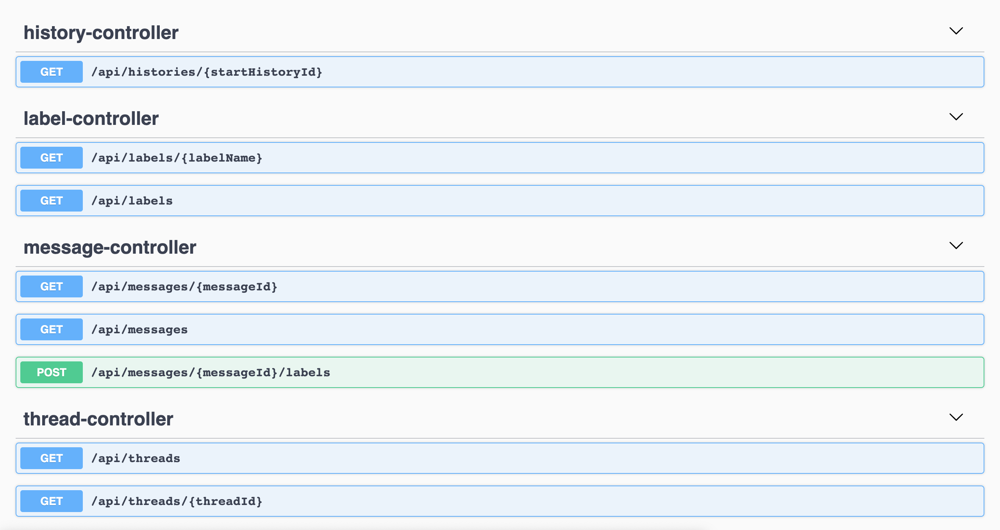
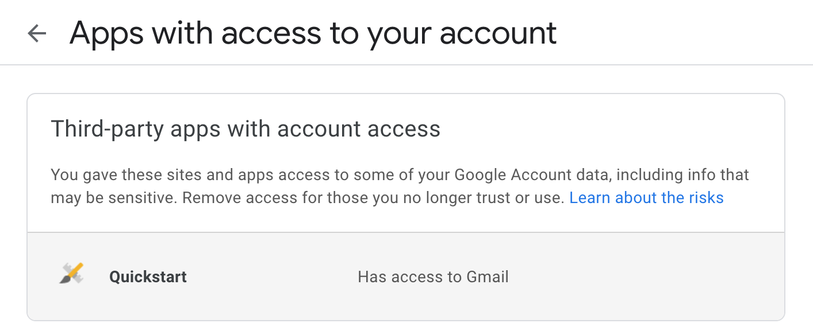

= springboot-gmail

The goal of this project is to implement a https://docs.spring.io/spring-boot/docs/current/reference/htmlsingle/[`Spring Boot`] Web Java application that communicates with a GMail inbox account using https://developers.google.com/gmail/api/[`GMail API`].

== Application endpoints

== Prerequisites

* https://www.google.com/gmail/about/[`GMail Account`]
* https://www.oracle.com/java/technologies/javase-jdk11-downloads.html[`Java 11+`]

== Getting client_id, client_secret and refresh_token

. Access https://developers.google.com/gmail/api/quickstart/java and go to `Step 1: Turn on the GMail API`;

. Click on the blue button `Enable the GMail API`;

. A window with title `Configure your OAuth client` will open. Keep the `Desktop app` selected (default) and click on `CREATE` button;

. A window with title `You're all set!` will open. Write down `client_id` and `client_secret`. They will be used on the next steps;

. In order to receive a callback from Google, let's start `springboot-gmail` application. So, open a terminal and inside `springboot-gmail` folder, run the following command
+
[source]
----
./mvnw clean spring-boot:run
----

. Open a browser and access the link below informing the `client_id` (obtained in the step 4.) and the scope that you allow the application to have;
+
CAUTION: In the link below, we are using the scope https://mail.google.com. It allows full access to the account! For more about scopes, please check https://developers.google.com/gmail/api/auth/scopes.
+
[source]
----
https://accounts.google.com/o/oauth2/auth?response_type=code&client_id=CLIENT_ID&scope=https://mail.google.com&redirect_uri=http://localhost:8080/callback
----

. Choose your Google account;

. A message will appear saying that `This app isn't verified`. Click on `Advanced` and then on `Go to Quickstart (unsafe)`

. Allow `Quickstart` to access your Google Account. You will get the `code` after completing all allowance steps. Write down this `code`. It will be used on the next step;

. Open a new terminal and run the following command, replacing `CODE` (obtained in the previous step), `CLIENT_ID` and `CLIENT_SECRET` (both obtained in the step 4.)
+
[source]
----
curl -i -X POST https://www.googleapis.com/oauth2/v4/token \
  -d "grant_type=authorization_code" \
  -d "code=CODE" \
  -d "client_id=CLIENT_ID" \
  -d "client_secret=CLIENT_SECRET" \
  -d "redirect_uri=http://localhost:8080/callback"
----
+
It should return something like
+
[source]
----
HTTP/2 200
...
{
  "access_token": "ya29.a0AfH6...v0cIbuQ",
  "expires_in": 3599,
  "refresh_token": "1//030V4mwr2...jLNKI",
  "scope": "https://mail.google.com/",
  "token_type": "Bearer"
}
----

. **Done!** Now we have all the credentials needed to access GMail account, i.e, `client_id`, `client_secret` and `refresh_token`;

. You can shutdown the application by pressing `Ctrl+C`.

== Running application with Maven

* In a terminal, make sure you are inside `springboot-gmail` root folder

* Export the values of `client_id`, `client_secret` and `refresh_token` to their respective environment variable
+
[source]
----
export GMAIL_CLIENT_ID=...
export GMAIL_CLIENT_SECRET=...
export GMAIL_REFRESH_TOKEN=...
----

* Run the following command to start the application
+
[source]
----
./mvnw clean spring-boot:run
----

* `springboot-gmail` Swagger website can be accessed at http://localhost:8080/swagger-ui.html

== Disabling access to GMail API

. In a browser, access `https://myaccount.google.com/permissions`
. In `Third-party apps with account access` section, select `Quickstart`
+

. Finally, click on `REMOVE ACCESS` button.
+
image::images/remove-quickstart.png[Remove Quickstart,width='60%']
